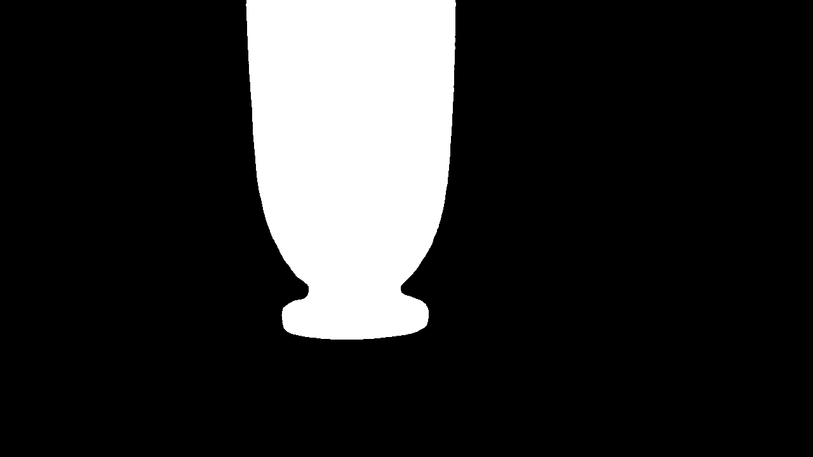
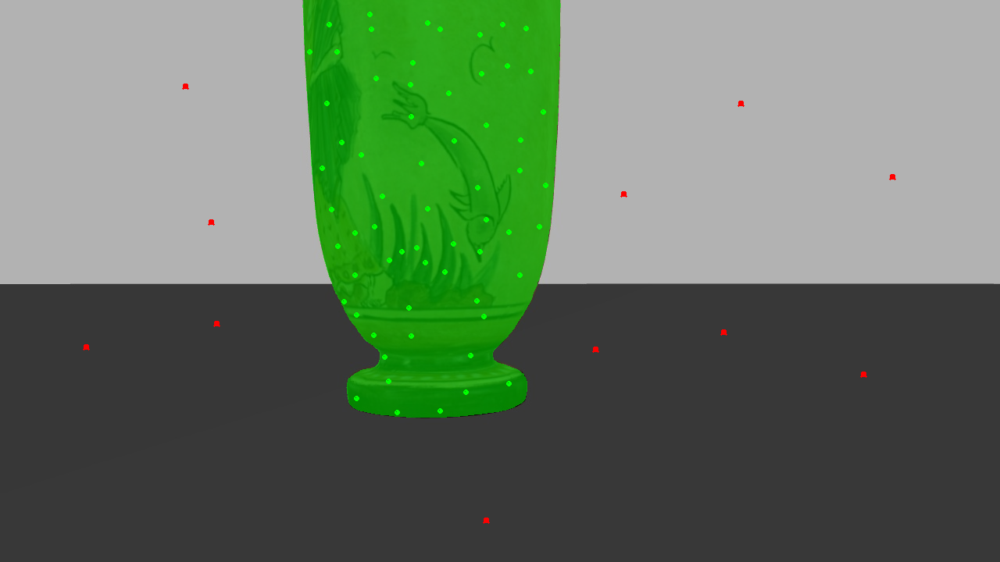
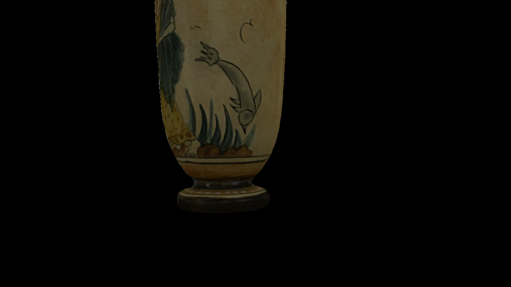
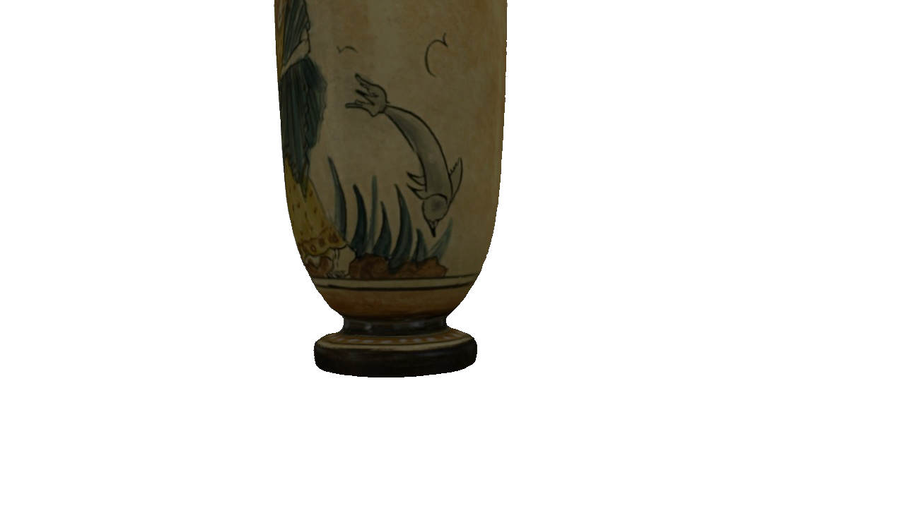

# sam\_fit\_sugar

"sam\_fit\_sugar" is a system that processes images to generate 3D meshes without backgrounds. By combining **SAM** (Surface-Aligned Mesh) and **SUGAR** (Surface-Aligned Gaussian Splatting), it aligns surfaces and creates efficient 3D models, perfect for applications requiring clean, background-free reconstructions.

## Quick Start

To get started with this project, follow these simple steps:

### 1. Clone the repository

Run the following command to clone the repository to your local machine:

```bash
git clone https://github.com/ZachariVaia/sam_fit_sugar.git
```

### 2. Navigate to the project directory

After cloning, go to the project folder:

```bash
cd sam_fit_sugar
```

### 3. Install dependencies

For the full functionality of this project, you need to install the following dependencies:

#### 3.1 Install SAM2-Docker

To install **SAM2-Docker**, follow these steps:

1. **Clone the repository**
   ```bash
   git clone https://github.com/peasant98/SAM2-Docker.git
   ```


#### 3.2 Install SuGaR

To install **SuGaR**, follow these steps:

1. **Clone the repository**

   ```bash
   git clone https://github.com/Anttwo/SuGaR.git
   ```


### 4. Prepare dataset

You need to prepare the dataset by creating a **data** folder inside the **SAM2-Docker** directory. Inside this **data** folder, you will store the images with a `.jpg` extension. The images should be placed in a subfolder named after your dataset.

Follow these steps:

1. Navigate to the **SAM2-Docker** directory:

   ```bash
   cd SAM2-Docker
   ```

2. Create the **data** folder if it doesn't already exist:

   ```bash
   mkdir -p data
   ```

3. Create a folder inside **data** to store your images. Name the folder after your dataset, for example:

   ```bash
   mkdir -p data/your_dataset_name
   ```

4. Place your `.jpg` images into the **your\_dataset\_name** folder.


Now, your **SAM2-Docker** directory should have the following structure:

```
SAM2-Docker/
├── data/
│   └── your_dataset_name/
│       ├── image1.jpg
│       ├── image2.jpg
│       └── ...
```

These images will now be ready to be processed by the SAM2-Docker system.

---


### 5. Set environment variables for the paths
Before running the pipeline, you need to set up the environment variables for the paths of the **SAM2-Docker** and **SuGaR-Docker** repositories.

Set the paths for **sam_fit_sugar**  by adding this line to your terminal:

```bash
export SAM_FIT_SUGAR_PATH="/path/to/SAM_FIT_SUGAR_PATH"
```

Make sure to replace `"/path/to/SAM_FIT_SUGAR_PATH"` with the correct path where the repositorie is located on your system.

### 6. Run the pipeline

Once the paths are set, you can run the pipeline with the following command:

```bash
cd sam_fit_sugar
./run_pipeline.sh your_dataset_name
```

This will execute the **SAM2** and **SuGaR** pipelines for the specified dataset.

---


# SAM2 + SuGaR Pipeline for 3D Reconstruction

## Overview

This project uses the SAM2 and SuGaR frameworks for 3D reconstruction of images, generating high-quality models with background removal. By clicking on significant points in an image, the SAM2 model generates a mask that isolates the object of interest.

## Workflow

### 1. Image Loading and Point Annotation

The process starts by loading an image. The user can click on the image to add points of interest:

- **Left-click** to add **positive points** (marked in **green**).
- **Right-click** to add **negative points** (marked in **red**).

The tool allows the user to select specific regions of the image, which will later be used to create a mask.

#### Example Image (before mask creation):


### 2. Generating the Mask with SAM2

Once enough points are added, the SAM2 model generates a **mask** that isolates the object of interest. The mask is a binary image that shows the identified area.

#### Mask Output:


### 3. Overlay of Mask on Image

After the mask is created, it is applied to the original image, showing the object against a transparent or black background, as shown below:


#### Image with Mask:


### 4. Final Output

The final result is an image where the object is isolated from the background, ready for further processing or 3D reconstruction.

#### Final Image (Object Isolated):


## Steps to Use

1. **Clone the repository** and set up the environment.
2. **Load your images** into the appropriate directory.
3. **Run the pipeline** using the `run_pipeline.sh` script.
4. **Annotate the points** by clicking on the important areas of the image.
5. **Generate the mask**, which will be saved for further use.

For more details, check the documentation in the repository or the command line help.

